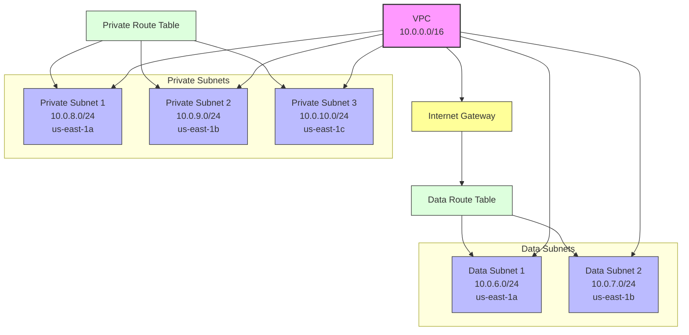

# AWS Infrastructure Diagram

## Infrastructure Components

### VPC Configuration
- VPC CIDR: 10.0.0.0/16
- Region: us-east-1
- Environment: dev

### Data Subnets
- Data Subnet 1: 10.0.6.0/24 (us-east-1a)
- Data Subnet 2: 10.0.7.0/24 (us-east-1b)
Features:
  - Internet access through IGW
  - Custom naming: ${environment}-data-subnet-1,2

### Private Subnets
- Private Subnet 1: 10.0.8.0/24 (us-east-1a)
- Private Subnet 2: 10.0.9.0/24 (us-east-1b)
- Private Subnet 3: 10.0.10.0/24 (us-east-1c)
Features:
  - No direct internet access
  - Custom naming: ${environment}-private-subnet-1,2,3

### Networking Components
1. **Internet Gateway**
   - Attached to VPC
   - Provides internet access for data subnets

2. **Route Tables**
   - Data Route Table: Routes traffic through Internet Gateway
   - Private Route Table: Internal routing only

### Resource Tags
All resources are tagged with:
- Environment: ${environment}
- Name: Resource-specific naming
- Terraform: "true"
- Additional custom tags from var.global_tags
