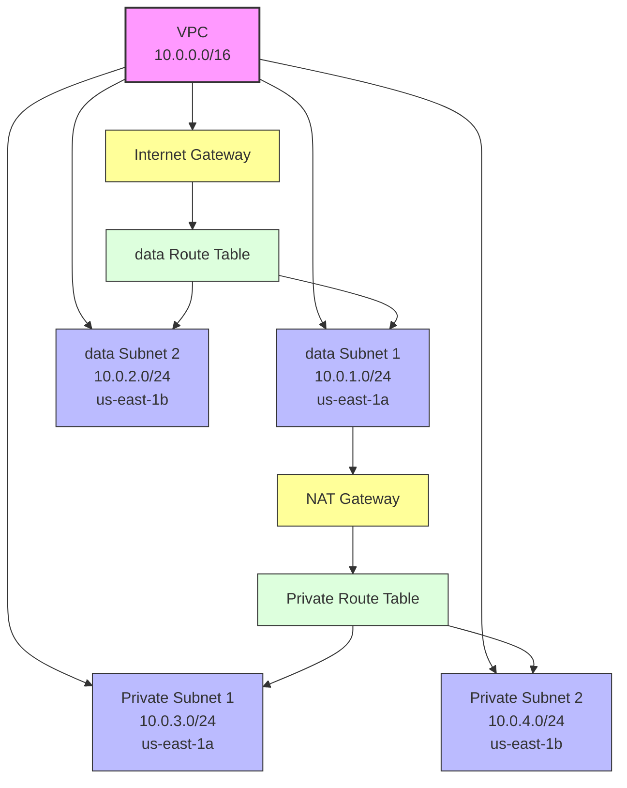

# AWS VPC Infrastructure Diagram

## Infrastructure Components

### VPC Configuration
- VPC CIDR: 10.0.0.0/16
- Region: us-east-1
- Environment: dev

### Networking Components
1. **data Subnets**
   - data Subnet 1: 10.0.1.0/24 (us-east-1a)
   - data Subnet 2: 10.0.2.0/24 (us-east-1b)

2. **Private Subnets**
   - Private Subnet 1: 10.0.3.0/24 (us-east-1a)
   - Private Subnet 2: 10.0.4.0/24 (us-east-1b)

3. **Gateways**
   - Internet Gateway: Attached to VPC
   - NAT Gateway: Located in data Subnet 1

4. **Routing**
   - data Route Table: Routes traffic through Internet Gateway
   - Private Route Table: Routes traffic through NAT Gateway

### Security and Access
- data subnets have direct internet access
- Private subnets access internet via NAT Gateway
- NAT Gateway provides outbound-only internet access for private subnets

### Resource Tags
- Environment: dev
- Project: iaac-poc
- Managed_by: Terraform
- Owner: DevOps
