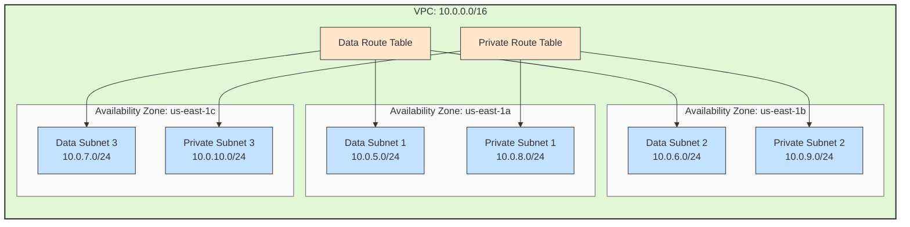

# AWS VPC Infrastructure Diagram

## Infrastructure Details

### 1. VPC Configuration
- **CIDR Block**: 10.0.0.0/16
- **DNS Support**: Enabled
- **DNS Hostnames**: Enabled
- **Region**: us-east-1

### 2. Data Subnets
| Subnet | CIDR Block | Availability Zone |
|--------|------------|------------------|
| Data Subnet 1 | 10.0.5.0/24 | us-east-1a |
| Data Subnet 2 | 10.0.6.0/24 | us-east-1b |
| Data Subnet 3 | 10.0.7.0/24 | us-east-1c |

### 3. Private Subnets
| Subnet | CIDR Block | Availability Zone |
|--------|------------|------------------|
| Private Subnet 1 | 10.0.8.0/24 | us-east-1a |
| Private Subnet 2 | 10.0.9.0/24 | us-east-1b |
| Private Subnet 3 | 10.0.10.0/24 | us-east-1c |

### 4. Routing Configuration
- **Data Route Table**
  - Associated with all data subnets
  - Each data subnet has its own route table association

- **Private Route Table**
  - Associated with all private subnets
  - Each private subnet has its own route table association

### 5. Resource Tags
- **Name**: [resource-name]-dev
- **Environment**: dev
- **Terraform**: true
- **Additional Tags**: Merged from global tags

### 6. High Availability
- Resources spread across three Availability Zones
- Each AZ contains one data subnet and one private subnet
- Ensures redundancy and fault tolerance
