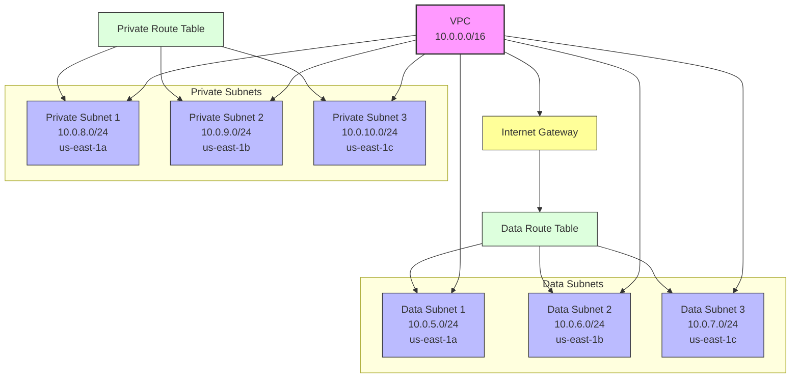

# Current AWS Infrastructure Diagram

## Infrastructure Details

### VPC Configuration
- VPC CIDR: 10.0.0.0/16
- Region: us-east-1
- Environment: ${var.environment}

### Data Subnets (with Internet Access)
1. Data Subnet 1
   - CIDR: 10.0.5.0/24
   - AZ: us-east-1a
   - Name: ${environment}-data-subnet-1

2. Data Subnet 2
   - CIDR: 10.0.6.0/24
   - AZ: us-east-1b
   - Name: ${environment}-data-subnet-2

3. Data Subnet 3
   - CIDR: 10.0.7.0/24
   - AZ: us-east-1c
   - Name: ${environment}-data-subnet-3

### Private Subnets
1. Private Subnet 1
   - CIDR: 10.0.8.0/24
   - AZ: us-east-1a
   - Name: ${environment}-private-subnet-1

2. Private Subnet 2
   - CIDR: 10.0.9.0/24
   - AZ: us-east-1b
   - Name: ${environment}-private-subnet-2

3. Private Subnet 3
   - CIDR: 10.0.10.0/24
   - AZ: us-east-1c
   - Name: ${environment}-private-subnet-3

### Network Components
1. **Internet Gateway**
   - Attached to VPC
   - Provides internet access for data subnets

2. **Route Tables**
   - Data Route Table
     - Routes traffic through Internet Gateway
     - Associated with all data subnets
   - Private Route Table
     - Internal routing only
     - Associated with all private subnets

### Resource Tags
All resources are tagged with:
- Name: Resource-specific naming
- Environment: ${var.environment}
- Terraform: "true"
- Additional tags from var.global_tags
